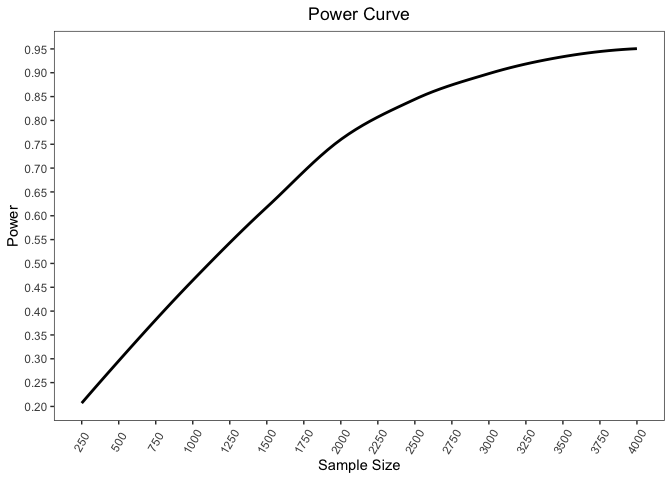

<!-- README.md is generated from README.Rmd. Please edit that file -->

# ZIPowerAnalysis

<!-- badges: start -->
<!-- badges: end -->

The goal of ZIPowerAnalysis is to …

## Installation

You can install the development version of ZIPowerAnalysis from
[GitHub](https://github.com/) with:

``` r
# install.packages("devtools")
devtools::install_github("dennist2/ZIPowerAnalysis")
```

## Example

This is a basic example which shows the model used on the Depression
data set in application portion of our paper

``` r
library(ZIPowerAnalysis)
ZI_Power(model=Depression~Sex+EOD_total,cov_interest = "EOD_total",family = "poisson",data = dat,nsim = 100,grid = seq(250,4000,250),padj = 0)
#> Loading required package: pacman
#>   |                                                                              |                                                                      |   0%  |                                                                              |====                                                                  |   6%  |                                                                              |=========                                                             |  12%  |                                                                              |=============                                                         |  19%  |                                                                              |==================                                                    |  25%  |                                                                              |======================                                                |  31%  |                                                                              |==========================                                            |  38%  |                                                                              |===============================                                       |  44%  |                                                                              |===================================                                   |  50%  |                                                                              |=======================================                               |  56%  |                                                                              |============================================                          |  62%  |                                                                              |================================================                      |  69%  |                                                                              |====================================================                  |  75%  |                                                                              |=========================================================             |  81%  |                                                                              |=============================================================         |  88%  |                                                                              |==================================================================    |  94%  |                                                                              |======================================================================| 100%
#> $Results
#>    SampleSize Power
#> 1         250  0.20
#> 2         500  0.30
#> 3         750  0.43
#> 4        1000  0.39
#> 5        1250  0.55
#> 6        1500  0.62
#> 7        1750  0.70
#> 8        2000  0.78
#> 9        2250  0.79
#> 10       2500  0.84
#> 11       2750  0.90
#> 12       3000  0.86
#> 13       3250  0.94
#> 14       3500  0.93
#> 15       3750  0.93
#> 16       4000  0.96
#> 
#> $Plot
#> `geom_smooth()` using formula = 'y ~ x'
```


